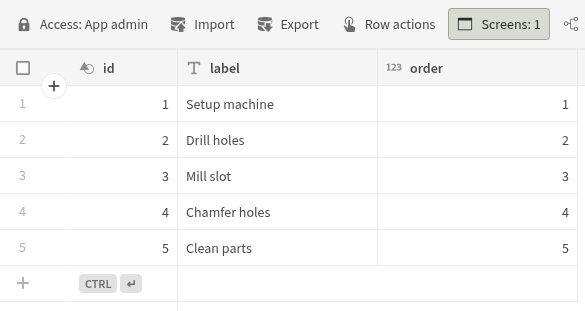
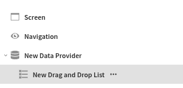
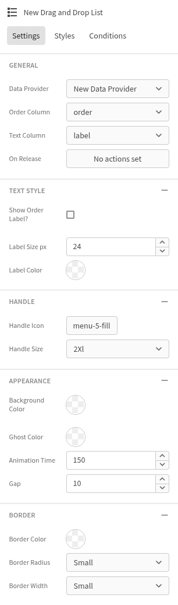

# Drag and Drop List
This is a readme for your new Budibase plugin.

# Description
Drag and Drop List using [svelte-sortablejs](https://github.com/jhubbardsf/svelte-sortablejs) by [jhubbardsf](https://github.com/jhubbardsf)

Find out more about [Budibase](https://github.com/Budibase/budibase).

# Usage
0. You need a table containing these columns (name can be random):

- text for the label/text
- number for the order (starts at 1)

1. Insert a data provider and set it to the table.

3. Insert the plugin as a child to the data provider.

5. Specifiy data provider, order column and label column. Set the rest acording to your needs.

## Disclaimer
Use at your own risk!

